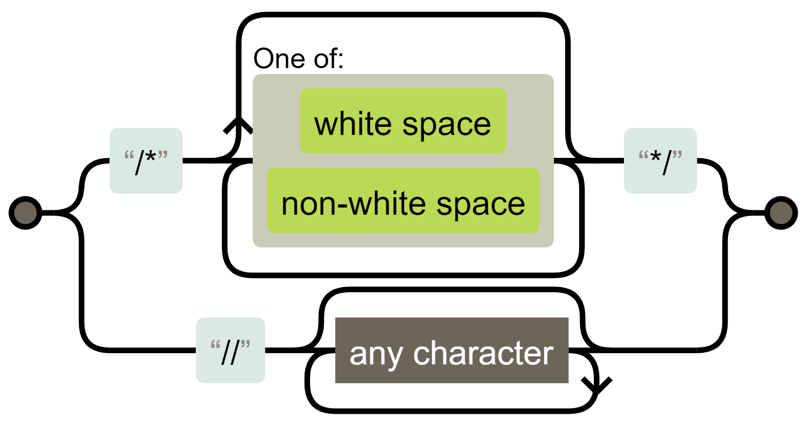

# JavaScript Regular Expressions

JavaScript regular expressions are a powerful tool for working with text, allowing you to search, validate, extract, and modify strings based on specified patterns. They are commonly used for tasks such as data validation (e.g., verifying email addresses or phone numbers), search and replace operations, and extracting information that matches specific criteria (e.g., dates or keywords).

Using regular expressions helps reduce code complexity and simplify text processing.

In JavaScript, regular expressions are implemented as a separate `RegExp` object and are integrated into string manipulation methods.


## Ways to Create Regular Expressions

A **regular expression** is a sequence of characters that defines search rules. It consists of a pattern and optional modifiers.

Without modifiers and special characters (which we will cover later), a regular expression search functions similarly to a simple substring search.

In JavaScript, there are two primary ways to create regular expressions:

- Literal notation (using slashes)

``` javascript
/pattern/modifiers; // syntax 

let regex1 = /hello/; 
let regex2 = /[a-z]/gi; 
```

-   `RegExp` constructor

``` javascript
let regex1 = new RegExp("hello");
let regex3 = new RegExp("[a-z]", "gi");
```

Literal notation is convenient when the pattern is known in advance and does not change—this applies to most cases. The slashes `/.../` indicate to JavaScript that this is a regular expression. They serve the same purpose as quotation marks for strings.  

The `RegExp` constructor allows for creating regular expressions dynamically, on the fly, for example, when the pattern or modifiers are provided by the user.

``` javascript
let tag = prompt("Which tag do you want to find?", "h2");

let regexp = new RegExp(`<${tag}>`); 
```

If the user responds to the prompt with the string "h2", the resulting regular expression will be `/<h2>/`.

## Modifiers of Regular Expressions

Regular expressions can have modifiers that change the behavior of the expression or provide additional information.

| Modifier | Description |
|-------------|-------------------------------------------------------------------|
| **i** | Performs a case-insensitive search: no distinction between `A` and `a`. |
| **g** | Searches for all matches, not just the first one (global search). |
| **m** | Enables multiline mode. |
| **y** | Searches only from a specific position (sticky mode). |
| **u** | Enables full Unicode support, ensuring correct handling of surrogate pairs. |
| **s** | Allows the dot (`.`) to match newline characters (dotall mode). |
| **d** | Provides match position information in the string (introduced in ES2022). Adds the **indices** property, an array containing the start and end indexes of substrings. |

Modifiers can be specified in two ways:

- After the closing slash: `/pattern/flags`.
- In the **RegExp** constructor:


``` javascript
// Both variants are equivalent
let regex1 = /hello/gi;
let regex2 = new RegExp('hello', 'gi');
```

Modifiers can be combined:

``` javascript
let text = "Hello HELLO hello";
console.log(text.match(/hello/gi)); // ['Hello', 'HELLO', 'hello']
```

**Examples**

``` javascript
console.log(/hello/.test('HELLO')); // false
console.log(/hello/i.test('HELLO')); // true
```

``` javascript
'hello hello'.match(/hello/) // 'hello'
'hello hello'.match(/hello/g) // ['hello', 'hello']
```

``` javascript
console.log('line1\nline2'.match(/^line/g)); // [ 'line' ]
console.log('line1\nline2'.match(/^line/gm)); // ['line', 'line']
```

``` javascript
let multiline = `First line
Second line
Third line`;

// ^ and $ now work for each line.
console.log(multiline.match(/^Second/));  // null
console.log(multiline.match(/^Second/m)); // ['Second']
```

``` javascript
let regex = /\d/y;
regex.lastIndex = 1;
'a1b2'.match(regex) // ['1']

regex.lastIndex = 3;
'a1b2'.match(regex) // '2'
```

``` javascript
/\u{1F600}/u.test('😀') // true
console.log(/^.$/u.test('😀')); // true
```

``` javascript
let str = "Hello World";
let regexp = /World/d;
let result = regexp.exec(str);

console.log(result.indices[0]); // [6, 11]
// 6 - starting position of the match
// 11 - ending position of the match
```

The `d` modifier is useful when you need to:  

- Determine the exact position of matches in the text  
- Highlight the found text  
- Create parsers  

Important to know:  
Modifiers can significantly impact the performance of regular expressions, especially when working with large texts.

## Sets and Ranges

Several characters or character classes enclosed in square brackets `[…]` mean “search for any character from the specified set.”

For example, `[eao]` matches any of the three characters: `'a'`, `'e'`, or `'o'`. This is called a **set**.

Note that a set contains multiple characters, but in a match, it corresponds to exactly one character.  

In square brackets, you can specify *ranges*, for example, `[a-z]` matches a character in the range from a to z, or `[0-5]` — a digit from 0 to 5.

In [0-9A-F], there are two ranges at once: it looks for a character that is either a digit from 0 to 9 or a letter from A to F.

If we want to find letters in both uppercase and lowercase, we can add the range: `[0-9A-Fa-f]`. Or set the `i` modifier in the regular expression.

| Expression  | Description  |
|------------|-------------------------------------|
| `[abc]`   | Find any of the characters in brackets |
| `[^abc]`  | Find any character except those specified in brackets |
| `[0-9]`   | Find any digit in brackets from 0 to 9 |
| `(x\|y)`  | Find any of the alternatives separated by `\|` |

## Metacharacters or Character Classes

Character classes are simply shorthand for sets of characters.

| Class | Equivalent | Description |
|------|------------|----------------------------|
| `\d` | `[0-9]` | A digit from 0 to 9 |
| `\w` | `[a-zA-Z0-9_]` | A word character |
| `\s` | `[ \t\n\v\f\r]` | A whitespace character, plus some rare Unicode space characters |
| `\D` | `[^\d]` | Any character except a digit |
| `\W` | `[^\w]` | Any character except `\w`, meaning not a letter, digit, or underscore |
| `\S` | `[^\s]` | Any non-whitespace character |

For example, `\d\s\w` represents a digit followed by a whitespace character and then a word character, such as `1 a`.

Let's find the first digit in a phone number:

``` javascript
let str = "+1(900)-123-45-67";

let regexp = /\d/;

console.log(str.match(regexp)); // 1
```

Let's add the `g` modifier to find all digits.

``` javascript
let str = "+1(900)-123-45-67";

let regexp = /\d/g;

console.log(str.match(regexp)); 
// Array of matches: 1,9,0,0,1,2,3,4,5,6,7

// They can be used to form a purely numeric phone number
console.log(str.match(regexp).join('') ); // 19001234567
```

An alternative, shorter way is to find non-digit characters using `\D` and remove them from the string:

``` javascript
let str = "+1(900)-123-45-67";

console.log(str.replace(/\D/g, "")); // 19001234567
```

Important to know:

Inside character sets, the metacharacter `|` is treated as a regular symbol. For example, `[bak|bok|buk]` means exactly the same as `[baouk|]`.  

A regular expression can contain both regular characters and character classes.

## The Dot Represents Any Character

The dot `.` is a special character class that matches "any character except a newline."  

Note that the dot represents any character but not the absence of a character.

## Word Boundary

There are three types of positions that define a word boundary:  

- The beginning of the text, if its first character is `\w`.  
- A position within the text, where there is `\w` on one side and a non-`\w` character on the other, or vice versa.  
- The end of the text, if its last character is `\w`.

For example, the regular expression `\bJava\b` will match in the string `Hello, Java!`, where `Java` is a separate word, but it will not match in `Hello, JavaScript!`.

We can use `\b` not only with words but also with numbers.

For instance, the regular expression `\b\d\d\b` searches for standalone two-digit numbers. In other words, it requires that both before and after `\d\d`, there are characters other than `\w`, such as spaces or punctuation (or the beginning/end of the text).

**Example**

``` javascript
console.log( "1 23 456 78".match(/\b\d\d\b/g)); // [ '23', '78' ]
console.log( "12,34,56".match(/\b\d\d\b/g)); // [ '12', '34', '56' ]
```

You can think of `\b` as a zero-width character that is automatically inserted in the appropriate places. However, these boundaries are not visible in the result (since they have zero width), even though they match the pattern.

## Anchors: Start and End of a Line

The symbols `^` and `$` have special meanings in regular expressions. They are called 'anchors'.  

`^` means a match at the beginning of the text, and `$` means a match at the end.

| Modifier | Description |
|-------------|-------------------------------------------------------------------|
| `^m` | Find any lines that contain `m` at the beginning |
| `m$` | Find any lines that contain `m` at the end |

Let's check if the text starts with "Mary":

``` javascript
let str1 = "Mary had a little kitten";
console.log( /^Mary/.test(str1) ); // true
```

The pattern `^Mary` means: "start of the line, followed by Mary."  

Similarly, we can check if a line ends with the word 'fluffy':

``` javascript
let str1 = "The kitten was fluffy";
console.log( /fluffy$/.test(str1) ); // true
```

Let's check if a string represents a time in the format `12:34`, meaning two digits, followed by a colon, and then two more digits.

``` javascript
let goodInput = "12:34";
let badInput = "12:345";

let regexp = /^\d\d:\d\d$/;
console.log( regexp.test(goodInput) ); // true
console.log( regexp.test(badInput) ); // false
```

Note: The `^` symbol has a different meaning when placed inside square brackets—it indicates the start of a negative set (negation).

Important to know:

The behavior of anchors changes if the `m` modifier is present.

## Quantifiers

Quantifiers allow specifying the number of repetitions.

| Quantifier | Description |
|------------|------------------------------------------------------------------------|
| `m{X}`    | Find any lines that contain the sequence `m`, exactly `X` times |
| `m{X, Y}` | Find any lines that contain the sequence `m`, between `X` and `Y` times |
| `m{X,}`   | Find any lines that contain the sequence `m`, at least `X` times |

The simplest quantifier is a number in curly braces: `{n}`. It is added to a character (or character class, or set) and specifies how many occurrences of that character or set are required.  

The pattern `\d{5}` represents exactly 5 digits, equivalent to `\d\d\d\d\d`.  

The following example finds a five-digit number:

``` javascript
console.log("I'm 12345 years old".match(/\d{5}/) ); // "12345"
```

We can add `\b` to exclude numbers longer than five digits: `\b\d{5}\b`.  

To find numbers with 3 to 5 digits, we can specify the range in curly braces: `\d{3,5}`.  

For the most commonly used quantifiers, there are shorthand notations:

| Quantifier | Description |
|------------|-----------------------------------------------------------|
| `n+` | Means "one or more." Equivalent to `{1,}` |
| `n?` | Means "zero or one." Equivalent to `{0,1}`. Essentially makes the character optional |
| `n*` | Means "zero or more." Equivalent to `{0,}`. The character can repeat multiple times or be absent |

Quantifiers are used very frequently. They are the fundamental "building blocks" of complex regular expressions.  

## String Methods

As mentioned earlier, the use of regular expressions is integrated into string methods.

### str.match

The method `str.match(regexp)` for a string `str` returns matches based on the regular expression `regexp`.  

It has three modes of operation:

1. If the regular expression has the `g` modifier, it returns an array of all matches.
2. If there is no `g` modifier, it returns only the **first match** as an array, where index `0` contains the match, along with properties providing additional information.
3. Finally, if there are **no matches**, it returns `null`, regardless of the presence of `g`.

This is an important aspect. When there are no matches, it returns `null`, not an empty array. Forgetting this can easily lead to an error, for example:

``` javascript
let matches = "JavaScript".match(/HTML/); // = null

if (!matches.length) { // Error: null has no property 'length'
  console.log("Error in the line above");
}
```

If you want the result to always be an array, you can write it like this:

``` javascript
let matches = "JavaScript".match(/HTML/) || [];

if (!matches.length) {
  console.log("Збігів немає"); // now it works
}
```

### str.matchAll

The `str.matchAll(regexp)` method is a "new, improved" version of `str.match`.

It is primarily used to find all matches, including capturing groups.

Important to know:

This feature was added to the language recently. In older browsers, a polyfill may be required.  

It has three key differences from `match`:

- It **returns an iterable object** with results instead of an array. A regular array can be created using `Array.from`.  
- Each match is returned as an array with **capturing groups** (similar to `str.match` without `g`).  
- If **no matches** are found, it returns **an empty iterable object** instead of `null`.

**Example**

``` javascript
let str = '<h1>Hello, world!</h1>';
let regexp = /<(.*?)>/g;

let matchAll = str.matchAll(regexp);

console.log(matchAll);
// `[object RegExp String Iterator]`, not an array but an iterable object

matchAll = Array.from(matchAll); // now an array

let firstMatch = matchAll[0];
console.log( firstMatch[0] );  // <h1>
console.log( firstMatch[1] );  // h1
console.log( firstMatch.index );  // 0
console.log( firstMatch.input );  // <h1>Hello, world!</h1>
```

When iterating over the results of `matchAll` in a `for..of` loop, calling `Array.from` is not needed.

### str.search

The `str.search(regexp)` method returns the position of the first match with `regexp` in the string `str` or `-1` if no match is found.

**Example**

``` javascript
let str = "I love JavaScript!";
let regexp = /Java.+/;

console.log(str.search(regexp)); // 7
```

An important limitation: `str.search` can only return the position of the **first** match. To find all occurrences, you can use `str.matchAll(regexp)`, for example.

### str.replace

The `str.replace(regexp, replacement)` method replaces matches of `regexp` in the string `str` with `replacement` (**all matches** if the `g` modifier is present, otherwise only the first one).

**Example**

``` javascript
console.log("We will, we will".replace(/we/i, "I")); // I will, we will
console.log("We will, we will".replace(/we/ig, "I")); // I will, I will
```

In the replacement string `replacement`, we can use special character combinations to insert fragments of the match:

| Special Characters | Action in Replacement String |
|----------------|--------------------------------|
| `$&`  | Inserts the entire matched substring |
| `` $` `` | Inserts the part of the string before the match |
| `$'` | Inserts the part of the string after the match |
| `$n` | Inserts the content of the n-th capturing group |
| `$<name>` | Inserts the content of the named capturing group `name` |
| `$$` | Inserts the `$` character |

**Example**

``` javascript
console.log("I love HTML".replace(/HTML/, "$& и JavaScript") ); 
// I love HTML и JavaScript
```

For situations requiring "smart" replacements, the second argument can be a function. It will be called for each match, and its result will be inserted as the replacement.  

## RegExp Methods

### regexp.test

The `regexp.test(str)` method checks whether there is at least one match. If so, it returns `true`; otherwise, it returns `false`.

``` javascript
let str = "I LoVe JavaScript";
let regexp = /love/i;

console.log(regexp.test(str)); // true
```

You don’t necessarily need to store the regular expression in a variable first:

``` javascript
console.log(/love/i.test("I LoVe JavaScript")); // true
```

### regexp.exec

The `regexp.exec(str)` method searches for a match of `regexp` in the string `str`.  

The behavior of the `exec` method differs depending on whether the regular expression has the `g` modifier.

- If there is no `g`, then `regexp.exec(str)` returns the first match exactly like `str.match(regexp)`. This behavior does not provide anything new.  
- If `g` is present, then:  
  - Calling `regexp.exec(str)` returns the first match and remembers the position after it as `regexp.lastIndex`.  
  - The next call starts searching from `regexp.lastIndex`, returns the next match, and updates `regexp.lastIndex` with the position after it.  
  - And so on.  
  - If there are no more matches, `regexp.exec` returns `null`, and `regexp.lastIndex` is reset to `0`.

Before the introduction of the `str.matchAll` method in JavaScript, `regexp.exec` was used to retrieve all matches along with their positions and capturing groups in a loop.  

We can use `regexp.exec` to search for a match starting from a specific position by manually setting `lastIndex`.

``` javascript
let str = 'Hello, world!';

let regexp = /\w+/g; // Without g, the lastIndex property is ignored
regexp.lastIndex = 5; // Start searching from the 5th position (i.e., from the comma onward)

console.log( regexp.exec(str) ); // world
```

## Testing Regular Expressions

There are several useful tools for testing and visualizing regular expressions.  

[Regexper](https://regexper.com/) is an open-source tool that works directly in the browser without installation. It helps understand how a regular expression works by converting it into a visual **Railroad Diagram**.

**Example**

In JavaScript, there are two types of comments: `//` and `/*...*/`. A regular expression for finding comments can be visualized.

``` javascript
/\/\*[\s\S]*?\*\/|\/\/.*/
```



Diagrams are useful for finding errors in your regular expressions and make it easier to modify complex expressions written by others.  

[regex101](https://regex101.com/) is another popular online tool that helps create and debug regular expressions. It provides **step-by-step match explanations**, **syntax highlighting**, and **reference materials** on regular expression syntax.  

The main benefit of these tools is **instant feedback**. They highlight matches and explain why certain parts of the pattern did not work.

## Complete Guide to Regular Expressions

Full information can be found in our Complete Guide to JavaScript Regular Expressions.  

<mark>**TODO: Add link.**</mark>

## Useful Practical Examples

### Replace Multiple Spaces with a Single Space

``` javascript
const text = "many    spaces    here";
console.log(text.replace(/\s+/g, ' ')); 
// Result: "many spaces here"
```

### Extract Specific Data from a String

Let's extract all numbers from the text.

``` javascript
let regex = /\d+/g;
let res = "Pinocchio had 1 alphabet and 30 soldi".match(regex);
console.log(res);
```

## FAQ on Regular Expressions

### What is the difference between `match()` and `exec()`?
`match()` is a method of a string, while `exec()` is a method of a regular expression.

``` javascript
const text = "test1 test2";
// match() returns all matches at once
console.log(text.match(/test\d/g)); // ['test1', 'test2']

// exec() returns one match per call
const regex = /test\d/g;
console.log(regex.exec(text)); // ['test1']
console.log(regex.exec(text)); // ['test2']
```
Which method to choose?

- Use `match()` when you need to find **all matches at once** (with the `g` flag).  
- Use `exec()` when you need **detailed information** about matches or when processing matches **one by one**.  

### How to make a group non-capturing?
Use `(?:...)`

``` javascript
const text = "I love Javascript";
console.log(text.match(/(?:I) (love)/)); 
// ['I love', 'love']
```

### How to Handle Errors When Working with Regular Expressions?

Use the `try/catch` construct

``` javascript
try {
    const userInput = "* ("; 
    new RegExp(userInput);
} catch (e) {
    console.log("Invalid regular expression");
}
```

To avoid syntax errors, always test regular expressions in specialized tools (online testers, IDEs with syntax highlighting, etc.).

### Why Do We Need to Escape Special Characters?

A **backslash (`\`)** is used to denote character classes, such as `\d`. It is a **special character** in regular expressions (as well as in regular strings).  

There are other **special characters** that have a unique meaning in regular expressions. They are used for more complex search patterns. Here is a list of these characters: `[ ] \ ^ $ . | ? * + ( )`.  

Suppose we want to find **a literal dot (`.`)** instead of "any character."

To use a special character as a literal, prepend it with a backslash: `\.`.  

This process is called "escaping a character."

``` javascript
const price = "$100.50";
// Incorrect: const regex = /$/;
// Correct:
const regex = /\$/;
```

Parentheses are also special characters, so if we need to use them literally, we must write `\(`.  

The **slash (`/`)** is not a special character in regular expressions, but in JavaScript, it is used to **open and close** a regular expression: `/...pattern.../`. Therefore, we must **escape it**.  

Here’s how to search for a slash (`/`):

``` javascript
console.log("/".match(/\//)); // '/'
```

On the other hand, if we do not use the `/.../` notation but create a regular expression using `new RegExp`, then we do not need to escape the slash:

``` javascript
console.log( "/".match(new RegExp("/")) ); // finds /
```

### What is the Difference Between the Dot (`.`) and `\s\S`?

The expression `.*` does not capture a newline, unlike `\s\S`.
